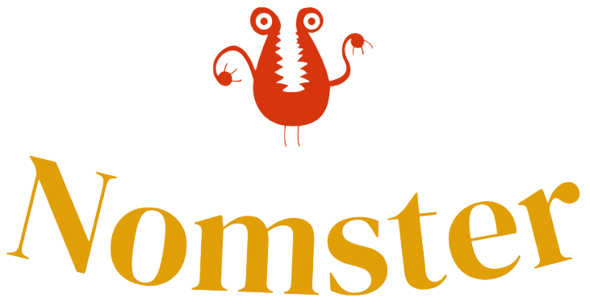

# Nonmster

## Intro
This is a recipe app.

## Tech Stack
**Client:** Flutter, Provider

## Features
- Recipe Search
- Recipe Recommendation
- Cross platform

## Process
At first I had this idea for a webapp instead but my friend who wanted me to build a mobile app with him, suggested that I make it an app instead so
I can learn app development before hopping on a project together. Then it came to deciding the framework, two stoodout: React Native and Flutter.
I wanted to get away from react and try something new, so I decided on Flutter. So I looked up a quick tutorial of flutter on YouTube and got into it.

For the first two weeks I spent a lot of time regretting my flutter choice, wondering why I decided to leave JavaScript. With all these data models for API intergration, widgets, and widgets just disappearing from the UI and I had no idea what was wrong, I began to think who let Google make a framework?

All I can say is now I am getting the hang of it, it's not so frustrating anymore.

## Lesson Learned
- Choose React Native next time
- I learnt a new framework I guess

## Improvements
- I'd like to make the user get redirected to the recipe search page immediately then data follows to provide better UX
- Maybe change the UI a bit
- Infinite scrolling in the recipe search page

## Running the project
- Open VSCode
- Go to File, Open Folder... and locate flutter project
- Click on Flutter project folder and click Select Folder button
- In lower right corner click on No Device button and select "Run in flutter emulator" from the drop down. This should automatically launch android emulator you set up in Android Studio.
